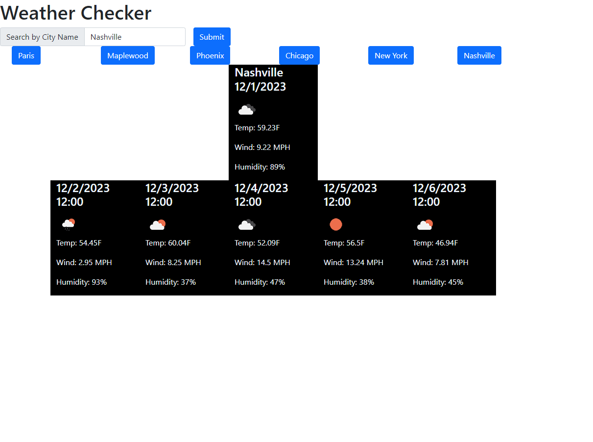

# **Module 6 Challenge:** Weather Forecast App

## Description

The goal of this project was to create a website that utilized API calls to OpenWeatherMap API to generate the current forecast, as well as the 5-day forecast, for a city of the user's choosing. Local storage was used to save the history of the user, allowing them to check a location's weather again in the future. Formatting/Styling was largely done using bootstrap, and jquery and dayjs were used within the javascript file. 

For practical use, the current forecast for the chosen location is calculated off the current time, while the 5-day forecast displays the weather at noon for each day.

## Preview

The project can be found at [this address]()

The following screenshot provides an example of how the page may look after some searches:
